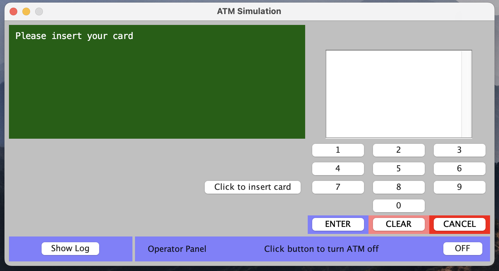
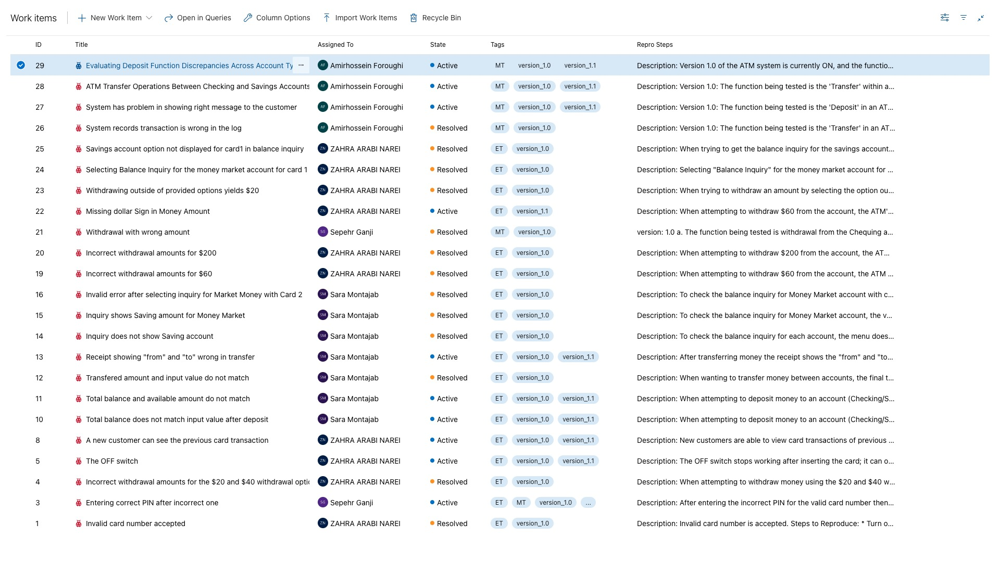

>   **SENG 637 - Dependability and Reliability of Software Systems**

**Lab. Report \#1 – Introduction to Testing and Defect Tracking**

| Group: 8       |
|----------------|
| Sepehr         |   
| Sara           |   
| Amir Hossein   |   
| Zahra          |
| Amir           |   

# Introduction

In this lab, we tested two versions of an ATM system software, which were consecutive releases with bugs and bug fixes included in them, that were contained within a zip file:
- ATM System - Lab 1 Version 1.0 (The first release)
- ATM System - Lab 1 Version 1.1 (The bugs are fixed)

We were assigned to test the ATM system with three methods:
1. Exploratory Testing (ET)
2. Manual Scripted Testing (MT)
3. Regression Testing (RT)

The system under the test is an ATM system with a UI very similar to physical ATM machines. At the very beginning of the execution of the program and right after switching the system on, user will be prompted to input the number of available $20 bills in the system. After that, user will see the main interface of the ATM, which is shown in the figure below:

In the exploratory testing phase, it is essential to have knowledge of the system's facts and functionalities, such as its purpose and capabilities. This approach typically does not require a script or plan prior to testing and allows for the tester to evaluate small units or the entire functionality of the program.
In the manual scripted testing phase, manual scripted testing, the script is written by others and not the tester. The script includes the system's requirements such as use cases, input, and expected outputs. The tester must test the functionality according to the script to ensure proper operation and correct output with proper input.

Finally, regression testing is conducted on the new version to confirm that all bugs have been fixed and no new bugs are present. After addressing bugs and releasing a new version of the program, it's essential to verify that the program functions as intended for stakeholders. Changes to some parts of the program can impact other parts. So, it's necessary to identify new failures to prevent future issues.

Before completing this lab, we were familiar with exploratory testing, also known as monkey testing in the industry. It is a form of testing that is based on the end user's understanding or expectations of the software system's functionality. 
Additionally, all of us have previous experience as a teacher assistant during our undergraduate program. One of our responsibilities was to grade students' assignments according to a predefined rubric, which is similar to manual scripted testing. Additionally, we also sometimes asked students to revise and correct errors in their assignments, which the process of re checking their assignments can be seen as a form of regression testing.
Moreover, we have used Azure Devops as the issue tracing system for this assignment. The found issued (along with their information) can be seen in the issue tab in this project. A screenshot of some of these issues is shown below:

# High-level description of the exploratory testing plan

In Exploratory testing phase, the goal is to test the system from a high-level view similar to customers. However, the testers need to know a general high-level requirements from the system. In order to do so, our plan is to read the high-level system requirements first (described in appendix B of assignment description) and try to test unplanned scenarios considering those requirements and check the actual outputs with the expected outputs from the requirements. However, it is important to make sure to do complex inquiries that cover most cases in the requirements or even more. Thus, we will test situations such as invalid inputs, multiple inquiries at one session, critical boundary situations. (Still unplanned) Afterwards, we will document the found issues with "ET" (Exploratory Testing) tag as Azure Devops bug work items.

# Comparison of exploratory and manual functional testing

Some of the main differences between ET and MT are mentioned below:
-   In ET, testers should rely on their own understanding from the system requirements and determine the test scenarios during the testing process, but in MT, testers are given specific test cases to follow. 
-   In MT, testers are given the exact expected outputs for each test case, but in ET however, testers need to verify the outputs from their own understanding of the system requirements.
-   Testers in ET need to be more literate about the system but MT testers do not.
-   ET is more probable to lead to unrecognized bugs from complex executaion paths since testers can be creative and test any situation.
-   ET is way more time consuming and expensive than MT since testers are not given the test cases and expected outputs. 
-   ET testers need to be experienced with testing principles in order to come up with critical boundary section. On the other hand, MT testers can be amatuers too.
-   MT probabely leads to tests closer to customers' expectations from the system since testers are not following pre-determined steps. Thus, non-functional requirements can be also covered by a higher chance in ET.
-   ET is more biased than MT since testers are choosing very specific paths to follow. Thus, repeating MT by different tesers might be less effective than repeating ET by several testers.
-   MT is more suitable for detecting bugs with stochastic behaviors since it is much easier to repeat an exact same test in MT.
-   When it comes to interactive and stateful softwares, it will get significantly harder to design MT tests because the number of possible combinations for the execution path will increase exponentially. But on the other hand, ET is not a good choice for scalable softwares.

| |ET |MT      |
|-|---|-------------|
|Scalibility||✓|   
|repeatability||✓|   
|comprehensiveness||✓|   
|System Knowledge Required|✓||
|Time efficiency|✓||   
|Creativity|✓||   

# Notes and discussion of the peer reviews of defect reports

Peer reviewing allowed for the practice of teamwork during testing by frequently engaging in peer development. It also aided in identifying potential bugs, discussing necessary features to test, and simplifying the process of reproducing bugs. We also put some hours to discuss with each other the format that we have to use in the Azure Devops and come to a conclusion about the tags that each bug should have.\
After hours of peer reviewing and discussion, we found some errors during the exploratory testing phase and several errors during the manual scripted testing phase. Also, we decided to tag the bug type with either ET or MT, and after the regression testing phase if it is resolved, change the status on the Azure Devops, but if the bug has remained, let it be in active status. In this way, if a bug is in active status, it means that it has remained after the regression testing phase, but if it is in Resolved status, then it is fixed in the newer version. All of these results were achieved with peer reviewing inside the team.

# How the pair testing was managed and team work/effort was divided 

For this project, we were divided into three teams: Sara and Zahra, Sepehr and AmirHossein, and Amir and Zahra. The first pair focused on identifying errors through exploratory testing, while the second pair aimed to find errors via manual scripted testing. Additionally, during the testing phase, the roles of tester and observer were swapped between members within the pairs. After documenting all identified errors, we combined the findings from both pairs. Subsequently, the third pair conducted regression testing to determine which errors persisted and which had been resolved in the new version. In the final stage of the project, we worked collaboratively. The team members began to log bugs in the Azure DevOps section, assigning appropriate tags to each. Furthermore, the members compiled a report detailing the process.

# Difficulties encountered, challenges overcome, and lessons learned

One of the difficulties was regarding exploratory testing since we needed to have a comprehensive perception from system requirements and characteristics in order to design the tests and evaluate the outputs. Moreover, it was harder to repeat an exact ET in order to double check a bug because ET steps are not exactly documented from before. Another difficulty was using Azure Devops for this phase because this phase did not include any coding and also pair works required us to be using a same machine.

# Comments/feedback on the lab and lab document itself

The assignment document clearly outlined the requirements, including the introduction and objectives. The Testing Definitions section helped to understand the distinctions between the three types of testing that were to be performed. Appendix B provided all the necessary information on the system under test and the use-case diagram assisted with exploratory testing. Our queries were promptly answered during office hours and through the TAs' emails.
